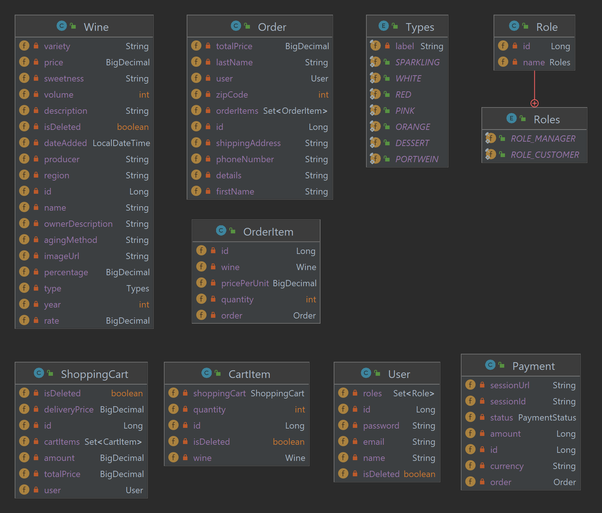

# Wine Shop 🍷

A Spring Boot–powered backend for a simple wine‐ecommerce system. Supports user registration & JWT-based authentication, role-based access control, wine catalog management, shopping cart & order processing, Stripe payment integration.

---

## 🚀 Features

- **Role-Based Access Control**  
  Secure API endpoints with `CUSTOMER` and `MANAGER` roles via Spring Security.

- **Authentication & Registration**  
  JWT-based login and signup; passwords hashed with BCrypt.

- **Wine Catalog Management**  
  Managers can add, update, and delete wines; customers can browse and view wine details.

- **Shopping Cart**  
  Persistent per-user cart supporting add, update, view, and remove item operations.

- **Order Processing**  
  Convert a shopping cart into an order; view and paginate orders and order items.

- **Stripe Payment Integration**  
  Create Checkout sessions in **гривні**, handle success and cancellation callbacks.

- **Database Migrations**  
  Schema changes managed via Liquibase.

- **Swagger / OpenAPI Documentation**  
  Interactive API docs available at `/swagger-ui/index.html`.

- **Testing**  
  Unit & integration tests with JUnit 5, Mockito, MockMvc, and an in-memory H2 database.

---

## 🛠️ Tech Stack

| Layer         | Technology                  |
|---------------|-----------------------------|
| Framework     | Spring Boot 3.x             |
| Security      | Spring Security, JWT        |
| Data Access   | Spring Data JPA (Hibernate) |
| DB Migrations | Liquibase                   |
| Database      | H2 (test) / MySQL (prod)    |
| Payments      | Stripe Java SDK             |
| API Docs      | Springdoc-OpenAPI (Swagger) |
| Testing       | JUnit 5, Mockito, MockMvc   |
| Build & CI/CD | Maven / GitHub Actions      |

---

## 📦 Getting Started

### Prerequisites

- Java 17+
- Maven 3.6+
- MySQL (or use embedded H2 for quick start)
- Stripe account & **Secret Key**

### Clone & Configure

```bash
git clone https://github.com/Oleksa-32/terroir-ua
cd terroir
```


## 📦 Configure Application Properties

Copy these into your `.env` file at the project root:

| Key                      | Example Value          |
|--------------------------|------------------------|
| `MYSQL_ROOT_PASSWORD`    | `password`             |
| `MYSQL_USER`             | `username`             |
| `MYSQL_PASSWORD`         | `password`             |
| `MYSQL_DATABASE`         | `wine_shop_db`         |
| `MYSQL_HOST_PORT`        | `3307`                 |
| `MYSQL_CONTAINER_PORT`   | `3306`                 |
| `SPRING_HOST_PORT`       | `8088`                 |
| `SPRING_CONTAINER_PORT`  | `8080`                 |
| `DEBUG_PORT`             | `5005`                 |
| `STRIPE_SECRET_KEY`      | `sk_test_…your_key…`   |

---

### Docker Compose

Build and start all services:

```bash
docker compose build
docker compose up
```

After Startup
API Base URL: http://localhost:8088

Swagger UI: http://localhost:8080/swagger-ui/index.html

# API Endpoints

Postman collection:[New Collection.postman_collection.json](New%20Collection.postman_collection.json)
## /auth
- `POST /auth/registration` – Register a new user (Public)
- `POST /auth/login` – Login an authenticated user (Public)

## /wines
- `POST /wines` – Create a new wine (Manager access)
- `GET /wines/{id}` – Get wine by ID (Public access)
- `GET /wines/{id}/recommendations` – Get recommendations for a wine (Public access)
- `GET /wines` – List all wines (Public access)
- `PUT /wines/{id}` – Update a wine (Manager access)
- `GET /wines/items` – List wine items (Public access)
- `GET /wines/search` – Search wines with filters (Public access)
- `GET /wines/recent` – List recently added wines (Public access)
- `DELETE /wines/{id}` – Delete a wine (Manager access)

## /cart
- `GET /cart` – Get current user’s shopping cart (Customer & Manager access)
- `GET /cart/all` – List all shopping carts (paginated) (Customer & Manager access)
- `POST /cart` – Add an item to your cart (Customer & Manager access)
- `PUT /cart/cart-items/{cartItemId}` – Update quantity of a cart item (Customer & Manager access)
- `DELETE /cart/cart-items/{cartItemId}` – Remove an item from your cart (Customer & Manager access)

## /orders
- `POST /orders` – Create a new order (Customer & Manager access)
- `GET /orders` – List your orders (Customer & Manager access)
- `GET /orders/{orderId}/items` – List items in an order (Customer & Manager access)
- `GET /orders/{orderId}/items/{itemId}` – Get a specific order item (Customer & Manager access)

## /payments
- `GET /payments?user_id={id}` – Get all payments for a user (Customer access)
- `POST /payments` – Create a Stripe payment session (Customer access)
- `GET /payments/success?session_id={id}` – Handle successful payment (Customer access)
- `GET /payments/cancel?session_id={id}` – Handle payment cancellation (Customer access)

## /users
- `PUT /users/{id}/role` – Update a user’s role (Manager access)
- `GET /users/me` – Get current user’s profile (Authenticated access)
- `PUT /users/me` – Update current user’s profile (Authenticated access)

# Entity Diagrams

